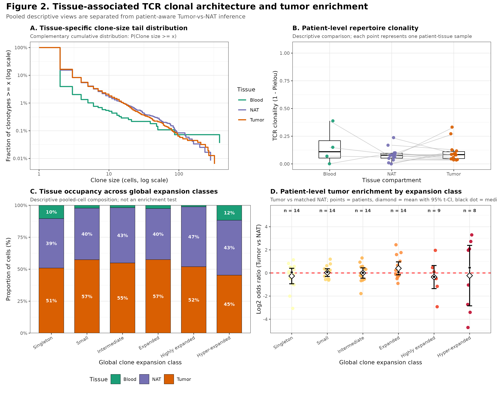
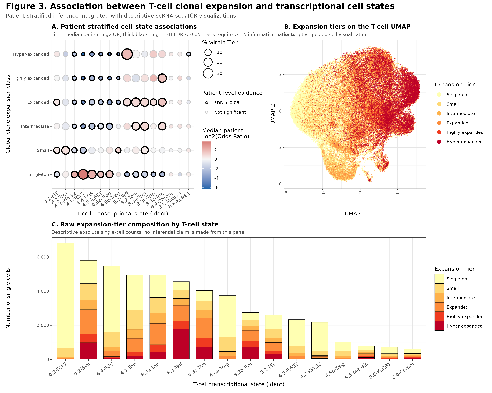
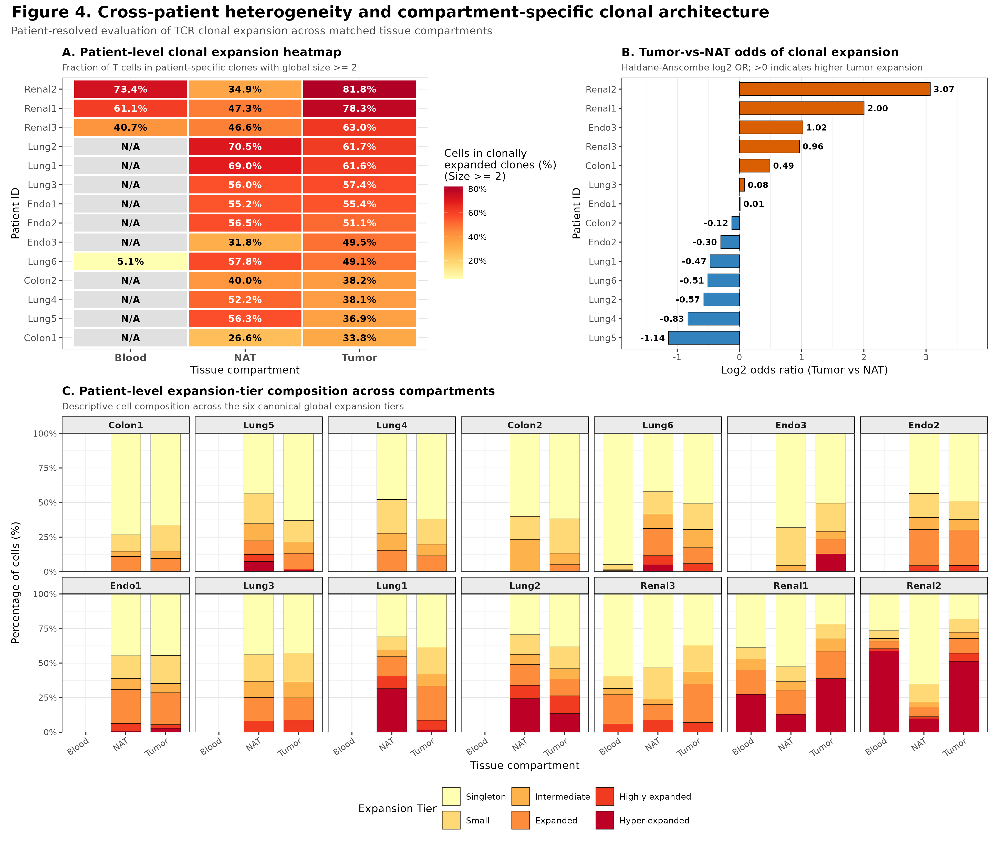
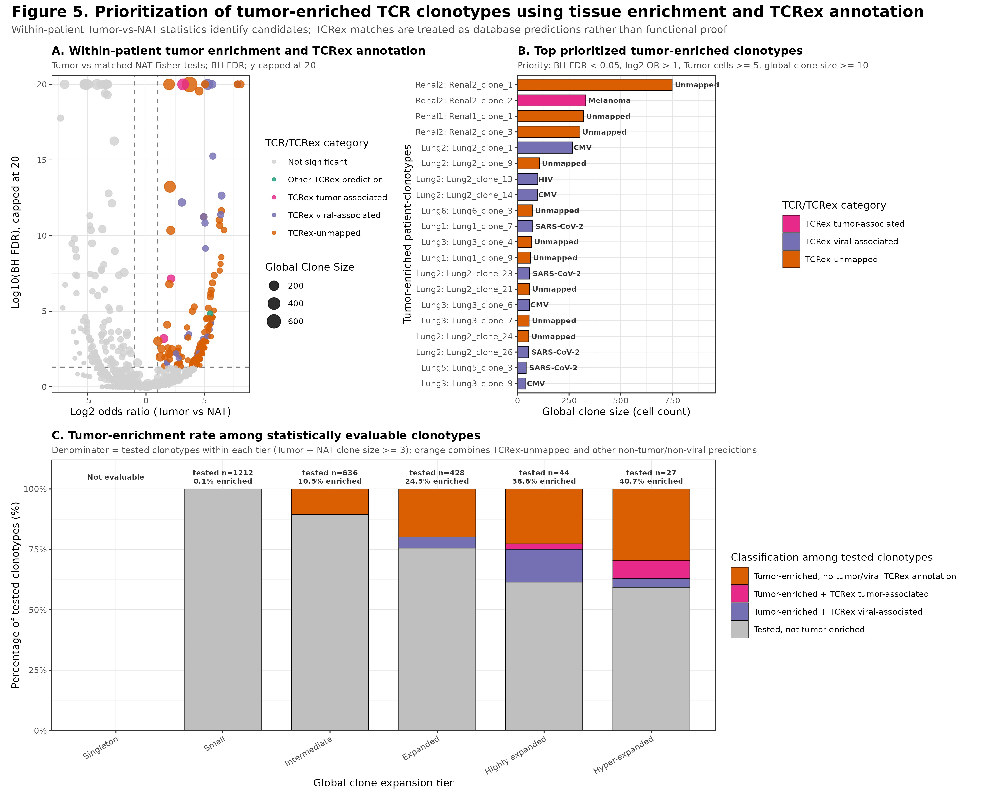

# Tumor-Associated TCR Clonal Architecture and Candidate Prioritization

An independent computational reanalysis of paired single-cell RNA-seq and TCR-seq data to characterize T-cell clonal architecture across tumor, normal-adjacent tissue (NAT), and peripheral blood, and to prioritize tumor-enriched TCR clonotypes for downstream experimental validation.

## Overview

This project integrates single-cell transcriptomic and TCR repertoire information to ask four related questions:

1. How is T-cell clonal expansion distributed across the repertoire?
2. How does clonal architecture differ across tumor, matched NAT, and peripheral blood?
3. Which transcriptional T-cell states are associated with clonal expansion across patients?
4. Which clonotypes are preferentially enriched in tumor relative to matched NAT, and what antigen specificities are suggested by TCRex annotation?

The analysis intentionally separates **pooled descriptive visualization** from **patient-aware statistical inference**. Patient-specific clonotypes are used throughout inferential analyses to avoid treating individual cells or clonotypes from the same patient as independent biological replicates.

## Dataset

The analysis is based on the publicly available **NCBI Gene Expression Omnibus (GEO) dataset GSE139555**:

> *Peripheral clonal expansion of T lymphocytes associates with tumour infiltration and response to cancer immunotherapy*

GEO accession: **GSE139555**  
NCBI GEO: https://www.ncbi.nlm.nih.gov/geo/query/acc.cgi?acc=GSE139555

The GEO series contains paired single-cell RNA-seq and single-cell TCR-seq data from **pretreatment samples of 14 cancer patients**, with samples collected from tumor, normal-adjacent tissue (NAT), and peripheral blood where available.

Processed files are available through GEO. The original study deposited raw scRNA-seq and scTCR-seq data in the European Genome-phenome Archive (EGA):

- scRNA-seq: **EGAS00001003993**
- scTCR-seq: **EGAS00001003994**

No patient-level raw or processed source data are redistributed in this repository.

## Analysis Workflow

The analysis pipeline includes:

- single-cell and TCR metadata import and quality control;
- productive TCR filtering and strict paired TCRαβ clonotype definition;
- patient-specific clonotype construction;
- clone-size and expansion-tier characterization;
- tissue-compartment repertoire analysis;
- integration of clonotype expansion with transcriptional T-cell states;
- patient-stratified odds-ratio analysis with BH-FDR correction;
- matched within-patient Tumor-vs-NAT comparisons;
- within-patient Fisher exact testing for tumor-enriched clonotypes;
- TCRex-based antigen-specificity annotation;
- effect-size and abundance-based candidate prioritization.

## Statistical Design

Descriptive figures may pool cells across the dataset when the purpose is to visualize global repertoire structure or cell-state composition.

Inferential analyses are patient-aware:

- tissue enrichment is evaluated using matched Tumor-vs-NAT comparisons;
- cell-state associations are summarized across patient-level effects;
- tumor-enriched clonotypes are tested within patient;
- multiple comparisons are controlled using the Benjamini-Hochberg false discovery rate (BH-FDR).

This design avoids using thousands of cells from the same patient as independent biological replicates.

## Main Figures

### Figure 1 — T-cell clonal architecture and cellular mass contribution

Clone-size rank-abundance distribution, expansion-tier abundance, and cellular mass contributed by each expansion tier.


<p align="center">
  
</p>
---

### Figure 2 — Tissue-associated TCR clonal architecture and tumor enrichment

Tissue-specific clone-size distributions, patient-level repertoire clonality, tissue occupancy, and patient-aware Tumor-vs-NAT enrichment analysis.


<p align="center">
  
</p>
---

### Figure 3 — T-cell clonal expansion and transcriptional cell states

Patient-stratified associations between clonal expansion tiers and transcriptional T-cell states, together with descriptive UMAP visualization.


<p align="center">
  
</p>
---

### Figure 4 — Cross-patient heterogeneity in clonal architecture

Patient-resolved comparison of clonal expansion across tumor, normal-adjacent tissue, and peripheral blood.


<p align="center">
  
</p>
---

### Figure 5 — Tumor-enriched TCR candidate prioritization

Within-patient Tumor-vs-NAT enrichment testing, BH-FDR correction, abundance/effect-size prioritization, and TCRex annotation.


<p align="center">
  
</p>
Final figure files can be placed under:

```text
results/figures/
```

## Repository Structure

```text
tumor-tcr-clonal-analysis/
├── README.md
├── LICENSE
├── .gitignore
├── data/
│   └── README.md
├── scripts/
│   ├── ...
│   └── figure/
│       ├── 11_figure_common.R
│       ├── 12_figure1_clonal_architecture.R
│       ├── 13_figure2_tissue_associated_clonality.R
│       ├── 14_figure3_clonotype_cell_state.R
│       ├── 15_figure4_patient_reproducibility.R
│       └── 16_figure5_tumor_associated_tcrs.R
└── results/
    └── figures/
```

## Data Availability

This repository contains analysis code and derived visualizations only. Source single-cell data are not redistributed.

To reproduce the analysis, obtain the GSE139555 data from NCBI GEO and place the required local files under the appropriate `data/` subdirectories described in `data/README.md`.

## Interpretation and Limitations

Tumor enrichment and TCRex annotation are used for **candidate prioritization**, not as direct evidence of tumor reactivity. Database-unmapped or tumor-enriched clonotypes require independent experimental validation, such as antigen-specific stimulation, tetramer assays, TCR reconstruction, or functional tumor-recognition assays.

TCRex annotations are computational/database-supported specificity predictions and should not be interpreted as definitive antigen assignments.

## Reproducibility

The analysis is implemented primarily in R using reproducible scripts. Intermediate and source datasets are intentionally excluded from version control because of file size and data-governance considerations.

## Acknowledgment

This project is an independent reanalysis of publicly available data from **GSE139555**. The original data generation and publication are credited to the investigators associated with that GEO series. This repository is not affiliated with or endorsed by the original authors.

## License

Code in this repository is released under the MIT License. The original GSE139555 data remain subject to the terms and policies of the repositories and original data providers.
